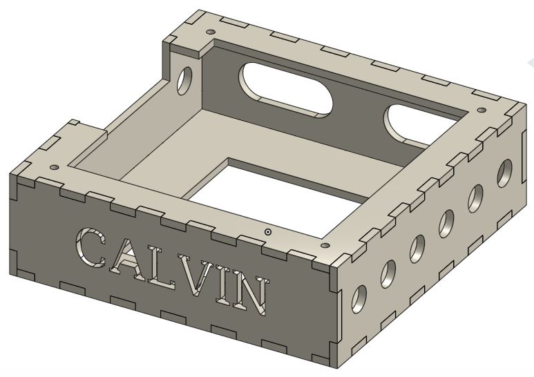

## Welcome to CALVIN's Website

Calvin was created by Keenan McConkey, Austin Khorram, and Glyn Finck for the University of British Columbia's Engineering Physics program's annual robot competition. This year's competition involved various tasks the robot must be able to execute such as line following, reading infrared beacons, picking up toys ("agents" as we called them) off platforms in a bucket filled with water and putting these toys into a box to be sent down a zip-line back to the beginning of the course. CALVIN has numerous features he uses as he attempts to complete this difficult challenge and rescue the agents!

### CALVIN's Main Features

* Wooden Chassis
* Black Tape Detectors
* Infrared Beacon Detectors
* Incline Detection Switches
* Modular H-Bridges and IR Signal Filters
* Servo Motor and Gear Actuated Crane, Arm, and Grabbing Claw
* TINAH Board (Arduino Board Variant)

### Navigating this site

Check out the pages below to learn more about CALVIN's different features.

* [Mechanical](mechanical.md)
* [Electrical](electrical.md)
* [Software](software.md)

### Photo Gallery

### Support or Contact

Regarding questions or inquiriues you can reach the team members at our team email address.

[CALVINteam@gmail.com](CALVINteam@gmail.com)
