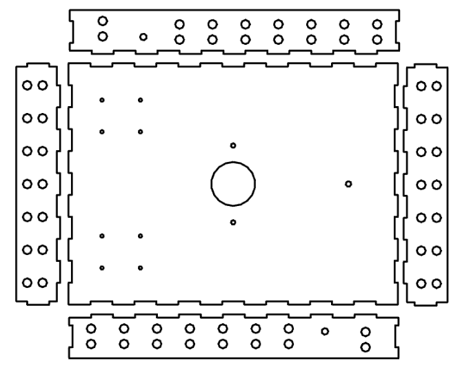
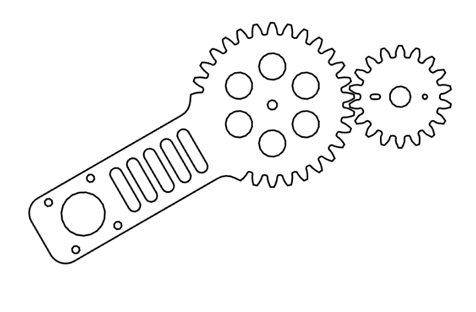
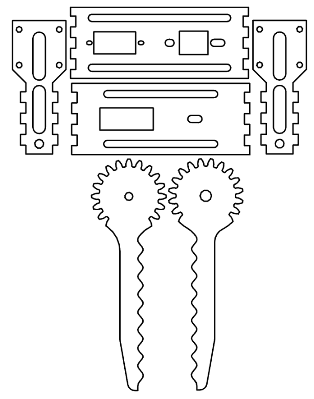
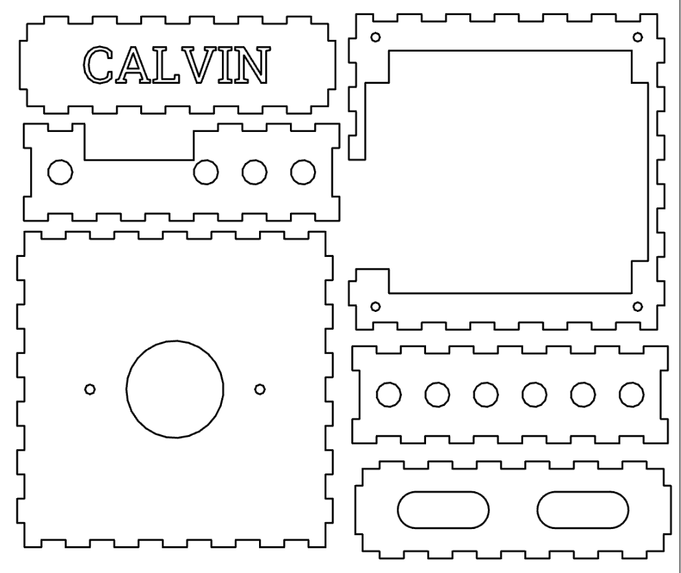

CALVIN's Mechanical Features
=====
Calvin was designed with mechanical simplicity in mind. In order to minimize man-made error in fabrication and assembly of components we created a minimalistic design using a single crane/arm combination with diverse functionality. 

### Materials
The majority of CALVIN's components were fabricated out of hardboard material of varying thicknesses.

### CALVIN's Major Mechanical Components:
#### Main Chassis
The main chassis is fabricated out of 3mm thick hardboard fabricated from a laser cutter and assembled with meccano pieces and hot glue. The chassis has many holes cut into it to allow wires and ziplines to weave through it.

#### Arm
CALVIN's arm is connected a rotating crane which extends from the rear of the chassis, and has the claw mounted by the four front holes. The arm is fabricated from 6mm thick hardboard and is gear actuated by the smaller gear attached to a servo motor (not shown below).

#### Claw and Claw Mount

#### H-Bridge Boxes

#### TINAH Board Mount and Wire Box

